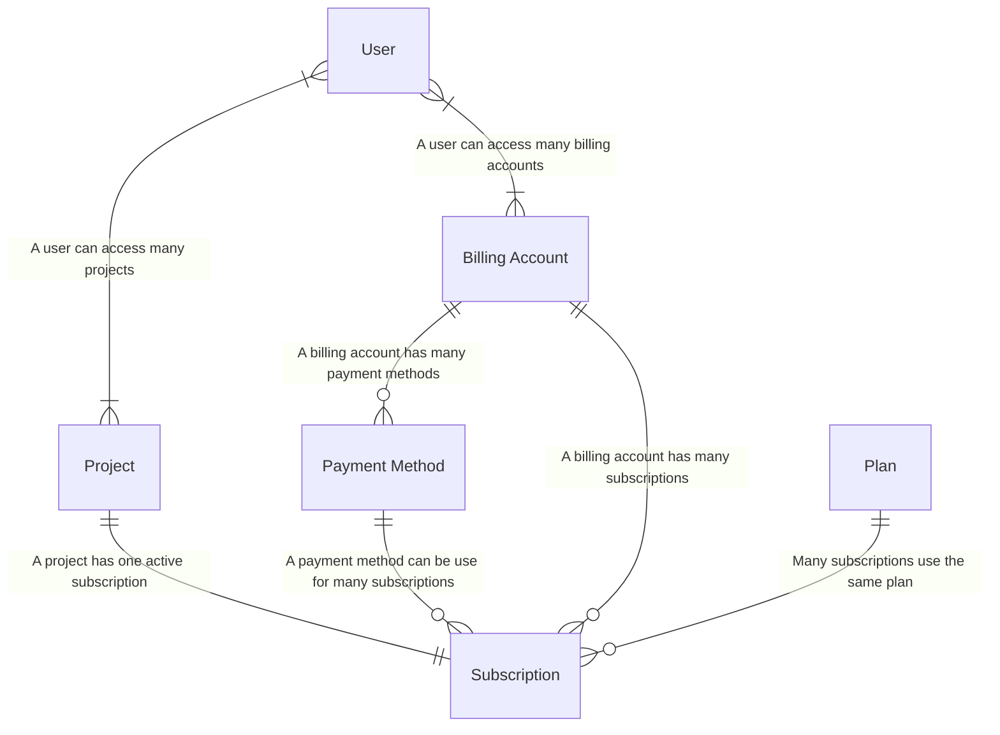

## Overview

[OpenFn.org](https://www.openfn.org) provides a secure, stable, scalable
cloud-hosted deployment of OpenFn as a turnkey, on-demand SaaS option that may
be more cost effective than managing your own local deployment.

Go to **[openfn.org/pricing](https://www.openfn.org/pricing)** to learn more
about our specific plans & service offerings, or read on for how to manage
billing accounts and subscriptions.

:::tip Need OpenFn on _Your_ Servers?

OpenFn can be deployed anywhere. Check out the
[Deployment docs](/documentation/deploy/options) to learn about supported
options and the "do-it-yourself" local deployment pathway. If you seek expert
help to manage your local deployment, check out the
[managed deployment services](https://www.openfn.org/pricing?hostingType=selfHosted)
offered by the OpenFn core team.

:::

## User Registration

When you create a cloud user account via OpenFn.org/signup, you are instantly
given access to a single project on the free tier and we create a personal
billing account (see [below](#billing-accounts)) which you can later use to
purchase additional project spaces or upgrade from the free plan.

## Billing Accounts

All projects _belong_ to a single billing account. The billing account houses
your:

- **Project Subscriptions** (your projects, each with their subscription);
- **Payment Methods** (credit cards & invoice payment methods); and
- **Billing Account Users** (the OpenFn users who can view or manage this
  billing account)

### Billing Account Users

By default, you are the owner of your own personal billing account. You can
invite other **managers** to add of modify payment methods and change the
subscription for a project. You can also add other **viewers** who can see the
project subscriptions in your account, the payment methods, and the other
billing account users but cannot modify any of them.

## Manage Subscriptions and Payment Methods

Read on or watch the below video for instructions on how to manage your
subscriptions and payment methods.

<iframe width="784" height="395" src="https://www.loom.com/embed/1d2ba366ee5f4d9e872e275dadc3cd52?sid=84eadb4b-64dd-4dad-8a2d-b282c70cb99e" frameborder="0" webkitallowfullscreen mozallowfullscreen allowfullscreen></iframe>

### Payment Methods

In order to upgrade your project subscription, you need an approved payment
method. Both "invoice" and "credit card" payment methods are allowed.

To manage your payment methods, click on the `Billing Account` menu (if you are
on the projects list or user profile page) or the `Subscription` menu (if you
are on the project/workflow page). From there, you can click on the
`Payment Methods` on the side menu.

#### Invoice Payment

When you add an invoice payment method you must wait for it to be approved by
the OpenFn.org team before you can use it.

:::tip Adding an Invoice Payment Method

To add an invoice payment method, click "Add a new invoice method" button on the
payment methods page. This will open a form that you can fill out and submit.
When you have successfully submitted the form, your invoice payment request will
listed and marked as `pending`.

Someone from OpenFn billing team will contact you to verify the provided
information before approving the payment method.

_Please note that you can only have ONE pending invoice payment method at a
time._

:::

#### Credit Card Payment

When adding credit card payment methods, the card details will be verified by
Stripe.com immediately and you can upgrade you subscriptions right away.

:::tip Adding a Credit Card Payment Method

To add a credit card payment method, click "Add a new card" button on the
payment methods page. This will open a form that you can fill out your card
details. Your card will be verified by Stripe.com immediately and you can use
the card to upgrade your subscription or create a new project subscription.

If you are not able to successfully add your card, please contact us at
support@openfn.org with the error(if any).

:::

### Plans & Limits

The full list of plans and limits are available at
[openfn.org/pricing](https://www.openfn.org/pricing).

### Upgrading your subscription

:::warning You need a valid payment method

Please ensure you have a valid payment method before trying to upgrade your
subscription. Check out the [Payment Methods](#payment-methods) section for more
details.

:::

To upgrade you subscription;

1. Click "Subscription" from your project dashboard
2. Click "Manage Subscription"
3. Select a plan from the list and scroll down to add additional runs if the
   base runs in your plan are not enough for your project. _(We recommend using
   the slider to set the value)_
4. Select a payment method to pay for the upgrade.
5. Scroll to the bottom of the page to review your subscription changes.
6. Click "Update subscription"

For upgrades, you will be billed immediately for the _difference_ between your
current plan and your new plan. At the end of your cycle, your next charge will
be only the cost of the new plan.

### Downgrading your subscription

For downgrades, you are allowed to continue using your current plan until your
cycle ends as you have already pre-paid for usage during that cycle. When the
cycle ends, the lower limits will be applied and your next charge will be for
the price of your new plan.

## Transferring Project Subscriptions

If you're a billing account manager, you can request to transfer ownership
(i.e., ask someone else to pay for) a project in your billing account. Enter
their email address, and they'll be notified.

To accept the transfer request, they will need to be a manager of at least one
billing account with an active payment method. They'll choose the billing
account, choose the payment method they want to use, and then the transfer will
be complete and _they_ will pay the next time a payment is owed for that
subscription.

## How It Fits Together (for the engineers 🤓)

