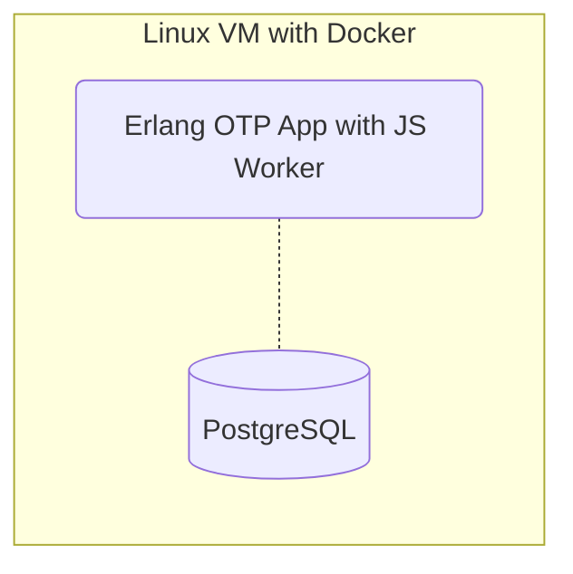
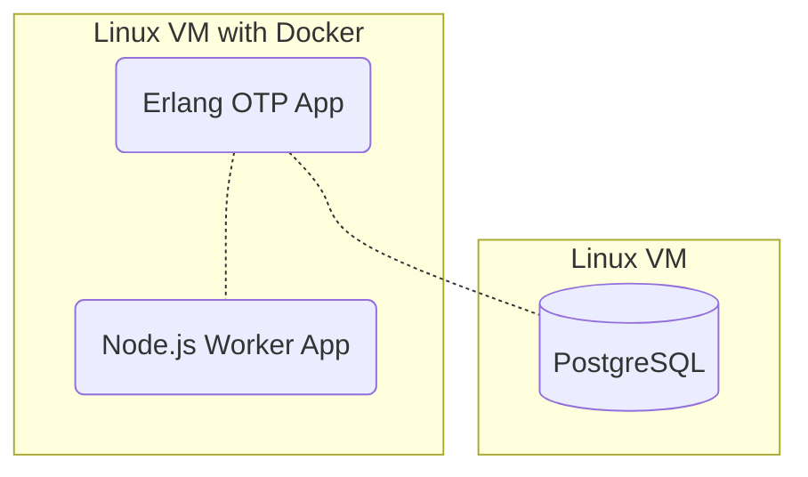
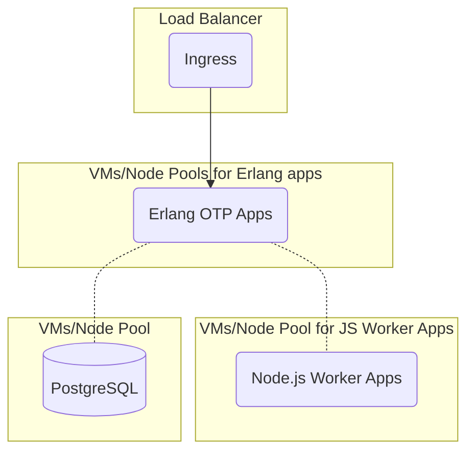

## Planifica primero {#plan-first}

¿No sabes por dónde empezar? Vuelve a la página
[Planificación](/deploy/options.md) para pensar cómo quieres escalar tus
proyectos de automatización con OpenFn.

## Evalúa tu capacidad {#assess-your-capacity}

:::info Ayuda a tu socio a estimar los costos iniciales y continuos

Usa estas preguntas para empezar a evaluar tu capacidad y tus recursos técnicos,
para que tu socio de despliegue pueda estimar mejor el costo total de propiedad.

:::

1. ¿Cómo se despliegan, supervisan y mantienen actualmente las aplicaciones en
   la nube en tu organización o gobierno? Cada entorno de despliegue y cada
   institución es única, y OpenFn es flexible: según tus procesos actuales de
   DevOps, te recomendaremos distintos mecanismos de despliegue.
2. ¿Qué personal de TI y de DevOps hay disponible para apoyar el despliegue y el
   mantenimiento de OpenFn? ¿Tiene experiencia con Docker y Kubernetes? ¿Tiene
   experiencia con bases de datos Postgres?
3. ¿El despliegue requerirá alta disponibilidad? (Es decir, si OpenFn va a
   recibir solicitudes en tiempo real desde otras aplicaciones en lugar de
   ejecutar jobs basados en cron, se deberían ejecutar al menos dos instancias
   de OpenFn a la vez detrás de un balanceador de carga, usando "Erlang
   distribuido" para lograr una redundancia de la aplicación sin interrupciones.
   Si OpenFn no va a recibir solicitudes y solo va a hacer solicitudes salientes
   con un horario cron, donde el momento exacto importa poco, mantener un
   sistema sin tiempo de inactividad es algo menos importante).

## Conocimientos necesarios {#knowledge-requirements}

| Habilidad  | Importancia y motivo                                                                                                                                                                                                                                                                                                        |
| ---------- | --------------------------------------------------------------------------------------------------------------------------------------------------------------------------------------------------------------------------------------------------------------------------------------------------------------------------- |
| Erlang     | La **capa de aplicación web y orquestación** de OpenFn es una aplicación Erlang OTP.                                                                                                                                                                                                                                        |
| JavaScript | Los **workers que procesan los jobs** de OpenFn y los propios workflows de OpenFn se basan en JavaScript. Si sabes cómo funciona Node.js, puedes crear workflows que hagan _cualquier cosa_.                                                                                                                                |
| Postgres   | La **base de datos** predeterminada de OpenFn es PostgreSQL                                                                                                                                                                                                                                                                 |
| Docker     | Publicamos todas las **[imágenes](https://hub.docker.com/repository/docker/openfn/lightning/general) de OpenFn** en Docker Hub. Tanto si quieres simplificar la configuración para desarrolladores como si usas tecnologías de orquestación de contenedores, te será útil entender Docker y la computación en contenedores. |
| Kubernetes | En los despliegues de alta disponibilidad, los servicios de Kubernetes ofrecen **balanceo de carga** y simplifican la **administración de contenedores** en varios hosts. Facilitan que las aplicaciones de una empresa sean más escalables, flexibles, portables y productivas.                                            |

## Requisitos de las máquinas {#machine-requirements}

:::tip Si eliges "DIY", empieza por lo simple

Kubernetes _NO_ es obligatorio, pero se recomienda para los despliegues de alta
disponibilidad. Para una configuración más simple, considera un despliegue con
Docker o en servidores físicos (las aplicaciones Erlang OTP funcionan muy bien
en Linux).

:::

El SaaS oficial de OpenFn usa [Kubernetes](https://kubernetes.io/) para los
despliegues administrados en Google Cloud, y lo recomendamos para despliegues
escalables y de alta disponibilidad. Con cargas de trabajo variables, es
importante (por estabilidad y por costos) poder escalar el grupo de nodos y los
pods de la aplicación Erlang OTP por separado del grupo de nodos y los pods de
los workers de JavaScript.

1. Usar un servicio SQL escalable y mantener _al menos_ dos nodos de la
   aplicación en ejecución con las siguientes especificaciones ayudará a evitar
   tiempos de inactividad no deseados.
   1. **Solicitudes de GKE (requests):** cpu@ "500m", memory@ "1024Mi"
   2. **Límites de GKE (limits):** memory@ "2560Mi"
2. Para despliegues simples sin Kubernetes ni alta disponibilidad, las máquinas
   mínimas recomendadas son:
   - **Máquina de la aplicación:** 2 vCPU (más o menos un solo núcleo de un
     Intel Xeon E5 de 2.6 GHz) con 3.75 GB de memoria y 15 GB de almacenamiento
     para la aplicación
     1. Cualquier sistema operativo basado en Linux que pueda ejecutar Docker
        (Ubuntu 20.04+ o Debian 9+).
     2. Docker (18 o superior).
   - **Máquina de la base de datos:** 2 vCPU (más o menos un solo núcleo de un
     Intel Xeon E5 de 2.6 GHz) con 3.75 GB de memoria. El almacenamiento que
     necesita la base de datos depende de cuántos días de datos de mensajes
     quieras guardar en la propia aplicación (si quieres guardar alguno), y no
     se puede determinar sin estimar el volumen de mensajes y runs. Si ampliar
     el almacenamiento físico no es difícil en tu despliegue, empieza con 40 GB.
     1. Una instancia de Postgres (como mínimo v14.2), ejecutada en un _servidor
        distinto_ del de la aplicación para lograr más estabilidad.
3. Si la aplicación y la base de datos están alojadas en la misma máquina (lo
   que no se recomienda), esa máquina debería tener aproximadamente la suma de
   los requisitos anteriores.
4. **Ten en cuenta** que, de forma predeterminada, la aplicación ofrece un
   endpoint HTTP (sin TLS/SSL). Se espera que un proxy inverso o balanceador de
   carga proporcione HTTPS (compatible con HTTP2) y balanceo de carga entre las
   instancias.
   - _Es decir, el servidor de la aplicación no cifra el acceso web, así que
     hace falta un servidor web delante de la aplicación; Nginx con certificados
     TLS es un buen punto de partida._
5. Aunque la arquitectura de red depende del cliente, **recomendamos firmemente
   una subred privada** para los servidores de la aplicación.
6. No hace falta desplegar la aplicación de OpenFn en la misma máquina que otros
   servicios. Sin embargo, si los sistemas de origen y destino están alojados en
   otros servidores, habrá que configurar el enrutamiento de red y las reglas
   del firewall para que la integración pueda acceder a ellos.
7. Para la **resolución de problemas y el soporte externo**, los administradores
   necesitarán acceso SSH a una cuenta sin restricciones (`sudo` en Ubuntu) si
   se requieren servicios de mantenimiento del despliegue.

## Configuraciones posibles {#possible-configurations}

Aunque deberías planificar con cuidado tu estrategia de despliegue junto con un
especialista en DevOps, estas configuraciones de ejemplo pueden servirte como
punto de partida.

### (a) Simple {#a-simple}

Despliega la aplicación y la base de datos en la misma máquina.

### (b) Mínima recomendada {#b-recommended-minimum}

Despliega la aplicación y la base de datos en máquinas distintas.

### (c) Ideal {#c-ideal}

Escala automáticamente distintos grupos de nodos optimizados en un clúster de
Kubernetes para la aplicación de orquestación en Erlang y la aplicación de
workers de JavaScript.

Considera usar Postgres como servicio con alta disponibilidad, o ejecutarlo
también en un clúster.

