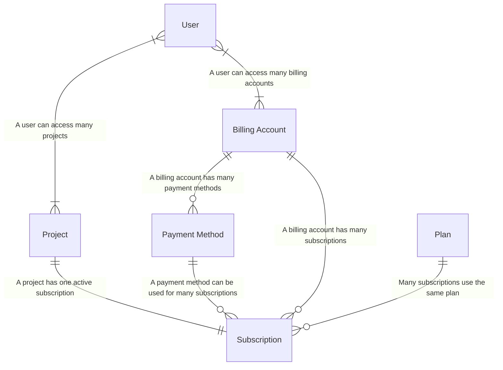

## Resumen {#overview}

[OpenFn.org](https://www.openfn.org) ofrece un despliegue de OpenFn seguro,
estable, escalable y alojado en la nube, como una opción SaaS lista para usar y
bajo demanda que puede resultar más rentable que gestionar tu propio despliegue
local.

Ve a **[openfn.org/pricing](https://www.openfn.org/pricing)** para conocer
nuestros planes y servicios, o sigue leyendo para saber cómo gestionar las
cuentas de facturación y las suscripciones.

:::tip ¿Necesitas OpenFn en _tus_ servidores?

OpenFn se puede desplegar en cualquier lugar. Consulta la
[documentación de despliegue](/deploy/options.md) para conocer las opciones
compatibles y la vía de despliegue local "hazlo tú mismo". Si buscas ayuda
experta para gestionar tu despliegue local, consulta los
[servicios de despliegue gestionado](https://www.openfn.org/pricing?hostingType=selfHosted)
que ofrece el equipo principal de OpenFn.

:::

## Registro de usuarios {#user-registration}

Cuando creas una cuenta de usuario en la nube desde OpenFn.org/signup, obtienes
acceso inmediato a un único proyecto del plan gratuito, y creamos una cuenta de
facturación personal (consulta [más abajo](#billing-accounts)) que luego puedes
usar para comprar project spaces adicionales o mejorar tu plan gratuito.

## Cuentas de facturación {#billing-accounts}

Todos los proyectos _pertenecen_ a una única cuenta de facturación. La cuenta de
facturación contiene:

- **Suscripciones de proyectos** (tus proyectos, cada uno con su suscripción);
- **Métodos de pago** (tarjetas de crédito y métodos de pago por factura); y
- **Usuarios de la cuenta de facturación** (los usuarios de OpenFn que pueden
  ver o gestionar esta cuenta de facturación)

### Usuarios de la cuenta de facturación {#billing-account-users}

De forma predeterminada, eres el propietario de tu propia cuenta de facturación
personal. Puedes invitar a otros **administradores** para que agreguen o
modifiquen métodos de pago y cambien la suscripción de un proyecto. También
puedes agregar **lectores**, que pueden ver las suscripciones de proyectos de tu
cuenta, los métodos de pago y los demás usuarios de la cuenta de facturación,
pero no pueden modificar nada de eso.

## Gestionar suscripciones y métodos de pago {#manage-subscriptions-and-payment-methods}

Sigue leyendo o mira el siguiente video para saber cómo gestionar tus
suscripciones y métodos de pago.

<iframe width="784" height="395" src="https://www.loom.com/embed/1d2ba366ee5f4d9e872e275dadc3cd52?sid=84eadb4b-64dd-4dad-8a2d-b282c70cb99e" frameborder="0" webkitallowfullscreen mozallowfullscreen allowfullscreen></iframe>

### Métodos de pago {#payment-methods}

Para mejorar la suscripción de tu proyecto, necesitas un método de pago
aprobado. Se admiten métodos de pago por "factura" y con "tarjeta de crédito".

Para gestionar tus métodos de pago, haz clic en el menú `Billing Account` (si
estás en la lista de proyectos o en la página de perfil de usuario) o en el menú
`Subscription` (si estás en la página del proyecto o del workflow). Desde ahí,
haz clic en `Payment Methods` en el menú lateral.

#### Pago por factura {#invoice-payment}

Cuando agregas un método de pago por factura, tienes que esperar a que el equipo
de OpenFn.org lo apruebe antes de poder usarlo.

:::tip Agregar un método de pago por factura

Para agregar un método de pago por factura, haz clic en el botón "Add a new
invoice method" de la página de métodos de pago. Se abrirá un formulario que
puedes completar y enviar. Cuando hayas enviado el formulario correctamente, tu
solicitud de pago por factura aparecerá en la lista marcada como `pending`.

Alguien del equipo de facturación de OpenFn se pondrá en contacto contigo para
verificar la información antes de aprobar el método de pago.

_Ten en cuenta que solo puedes tener UN método de pago por factura pendiente a
la vez._

:::

#### Pago con tarjeta de crédito {#credit-card-payment}

Cuando agregas una tarjeta de crédito como método de pago, Stripe.com verifica
los datos de la tarjeta de inmediato y puedes mejorar tus suscripciones en ese
mismo momento.

:::tip Agregar una tarjeta de crédito como método de pago

Para agregar una tarjeta de crédito como método de pago, haz clic en el botón
"Add a new card" de la página de métodos de pago. Se abrirá un formulario en el
que puedes completar los datos de tu tarjeta. Stripe.com verificará tu tarjeta
de inmediato y podrás usarla para mejorar tu suscripción o crear una nueva
suscripción de proyecto.

Si no consigues agregar tu tarjeta, contáctanos en support@openfn.org e indica
el error (si lo hay).

:::

### Planes y límites {#plans--limits}

La lista completa de planes y límites está disponible en
[openfn.org/pricing](https://www.openfn.org/pricing).

### Mejorar tu suscripción {#upgrading-your-subscription}

:::warning Necesitas un método de pago válido

Asegúrate de tener un método de pago válido antes de intentar mejorar tu
suscripción. Consulta la sección [Métodos de pago](#payment-methods) para más
detalles.

:::

Para mejorar tu suscripción:

1. Haz clic en "Subscription" en el panel de tu proyecto
2. Haz clic en "Manage Subscription"
3. Selecciona un plan de la lista y baja para agregar runs adicionales si los
   runs incluidos en tu plan no alcanzan para tu proyecto. _(Te recomendamos
   usar el control deslizante para fijar el valor)_
4. Selecciona un método de pago para pagar la mejora.
5. Baja hasta el final de la página para revisar los cambios en tu suscripción.
6. Haz clic en "Update subscription"

Al mejorar el plan, se te cobrará de inmediato la _diferencia_ entre tu plan
actual y el nuevo. Al final de tu ciclo, el siguiente cargo será solo el costo
del nuevo plan.

### Bajar de plan tu suscripción {#downgrading-your-subscription}

Al bajar de plan, puedes seguir usando tu plan actual hasta que termine el
ciclo, porque ya pagaste por adelantado el uso de ese ciclo. Cuando termina el
ciclo, se aplican los límites más bajos y el siguiente cargo será por el precio
del nuevo plan.

## Transferir suscripciones de proyectos {#transferring-project-subscriptions}

Si eres administrador de una cuenta de facturación, puedes solicitar transferir
la titularidad de un proyecto de tu cuenta de facturación (es decir, pedirle a
otra persona que lo pague). Escribe su correo electrónico y recibirá un aviso.

Para aceptar la solicitud de transferencia, esa persona tiene que ser
administradora de al menos una cuenta de facturación con un método de pago
activo. Elegirá la cuenta de facturación y el método de pago que quiere usar, y
entonces la transferencia se completará y será _ella_ quien pague la próxima vez
que haya que pagar esa suscripción.

## Cómo encaja todo (para los ingenieros 🤓) {#how-it-fits-together-for-the-engineers-}

