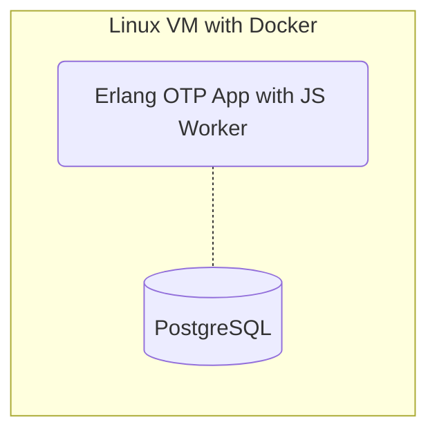
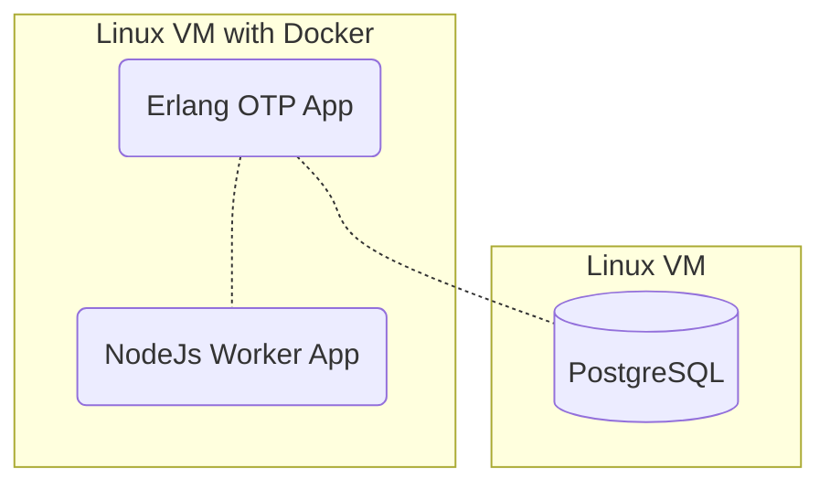
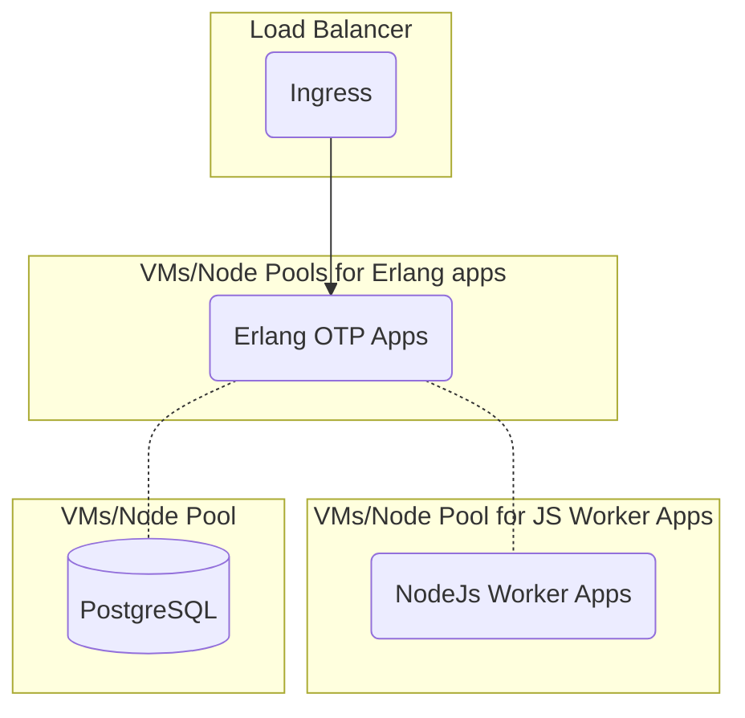

## Plan first

Not sure where to start? Head back to the
["Planning"](/documentation/deploy/options) page to think about how you want to
scale up your OpenFn automation projects.

## Assess your capacity

:::info Help your partner estimate up-front and ongoing costs

Use these questions to start assessing capacity and technical resources so that
your deployment partner can better estimate your total cost of ownership.

:::

1. How do you currently deploy, monitor, and maintain cloud-based applications
   at your organization/government? All deployment environments and institutions
   are unique and OpenFn is flexible; based on your current dev-ops processes we
   will recommend different deployment mechanisms.
2. What IT and DevOps staff resources are available to support OpenFn deployment
   and maintenance? Do they have experience with Docker & Kubernetes? Do they
   have experience with Postgres databases?
3. Will the deployment require high-availability? (i.e., if OpenFn will receive
   requests in real-time from other applications rather than run cron-based
   jobs, then at least two instances of OpenFn should be run simultaneously
   behind a load-balancer, making use of “distributed Erlang” to ensure graceful
   application redundancy; if OpenFn will not be responsible for receiving
   requests and will only be responsible for making relatively time-independent
   outbound requests on a cron schedule, the importance of maintaining a
   zero-downtime system is slightly reduced.)

## Knowledge Requirements

| Skill      | Relevance and reason                                                                                                                                                                                                                                                         |
| ---------- | ---------------------------------------------------------------------------------------------------------------------------------------------------------------------------------------------------------------------------------------------------------------------------- |
| Erlang     | The OpenFn **webapp/orchestration layer** is an Erlang OTP application.                                                                                                                                                                                                      |
| Javascript | The OpenFn **job processing workers** and OpenFn workflows themselves are Javascript-based. With knowledge of how NodeJs works you can build workflows that do _anything_.                                                                                                   |
| Postgres   | The default **database** for OpenFn is PostgreSQL                                                                                                                                                                                                                            |
| Docker     | We publish all **OpenFn [images](https://hub.docker.com/repository/docker/openfn/lightning/general)** on Docker Hub. Whether you're streamlining developer setup or using container orchestration technologies, understanding docker and containerized computing is helpful. |
| Kubernetes | For high-availability deployments, Kubernetes services provide **load balancing** and simplify **container management** on multiple hosts. They make it easy for an enterprise's apps to have greater scalability and be flexible, portable and more productive.             |

## Machine Requirements

:::tip If you're going with "DIY", start simple

Kubernetes is _NOT_ required, but it's recommended for high-availability
deployments. Consider docker or bare-metal deployments (Erlang OTP apps work
very well on Linux) for a simpler setup.

:::

The official OpenFn SaaS uses [Kubernetes](https://kubernetes.io/) for managed
deployments on Google Cloud and we recommend it for high-availability and
scalable deployments. With dynamic workloads, it is important (for stability and
cost reasons) to be able to scale the Erlang OTP app node pool & pods
independently of the Javascript worker node pool & pods.

1. Use a scalable SQL service and keeping _at least_ two app nodes running with
   the following specs will help prevent unwanted downtime.
   1. **GKE requests:** cpu@ "500m", memory@ "1024Mi"
   2. **GKE limits:** memory@ "2560Mi"
2. For a simple non-Kubernetes/HA deployments, the minimum recommended machines
   are:
   - **Application machine:** 2 vCPU (roughly a single core of a 2.6 GHz Intel
     Xeon E5) with 3.75 GB memory and 15 gb of storage for the application
     1. Any linux-based operating system that can run Docker (Ubuntu 20.04+ or
        Debian 9+).
     2. Docker (18 or greater).
   - **Database machine:** 2 vCPU (roughly a single core of a 2.6 GHz Intel Xeon
     E5) with 3.75 GB memory. Storage required for the DB varies by how many
     days (if any) of message data you’d like to store on the app itself and
     cannot be determined without estimates for message/run throughput. If
     scaling physical storage is not difficult for your particular deployment,
     start at 40gb. 3. A Postgres (at least v14.2) instance (as we run this on a
     _separate server_) from the application for greater stability.
3. If both the application and database are hosted on the same machine (which is
   not recommended) that machine should have roughly the sum of the requirements
   above.
4. **Note** that the application by default provides an HTTP endpoint (no
   TLS/SSL). A reverse-proxy/load-balancer is expected to provide both HTTPS
   (HTTP2 compliant) and load balancing between instances.
   - _I.e. the application server provides no encryption for web access, a web
     server in front of the application needs to be provided; Nginx is a good
     start, provided with TLS certificates._
5. While network architecture is up to the client, we strongly **recommend a
   private subnet** for the application servers.
6. The OpenFn application does not need to be deployed on the same machine as
   any other services, however network routing and firewall rules will need to
   be provided in order for the integration to access the source and destination
   systems if hosted on different servers.
7. For **troubleshooting/external support**, administrators will need SSH access
   to an unrestricted account (`sudo` for Ubuntu) if deployment maintenance
   services are required.

## Possible Configurations

While your deployment strategy should be carefully considered with a DevOps
specialist, the following sample configurations may provide useful starting
points.

### (a) Simple

Deploy the application and database on the same machine.

### (b) Recommended Minimum

Deploy the application and database on separate machines.

### (c) Ideal

Auto-scale different optimized node pools in a Kubernetes cluster for the Erlang
orchestration app and the Javascript worker app.

Consider high-availability Postgres-as-a-service, or also run it in a cluster.

